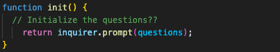

# Janet's Professional README Generator

### [View Project Video Here](https://drive.google.com/file/d/1Od5RjhkV9jCNbGp2n_SjrR4qz6pov_Dt/view?usp=sharing "Janet's Professional README Generator") 

| Technology Used    | Resource URL |
| --------  | ------- |
| NodeJS      | https://nodejs.org/en |
| Inquirer      | https://www.npmjs.com/package/inquirer |
| FS      | https://nodejs.org/api/fs.html |
| Screencastify | https://www.screencastify.com/ |
| JavaScript | https://developer.mozilla.org/en-US/docs/Web/JavaScript |
| Git       | https://git-scm.com/ |
| GitHub     | https://github.com/ |
| VSCode    | https://code.visualstudio.com/ |

## Table of Contents

* [Description](#description)
* [Installation](#installation)
* [Usage](#usage)
* [Credits](#credits)
* [License](#license)

## Description:
This application acts as a wizard to write a professional README for your project. 
 

#### How to use this app:

* Recommended Requirements: 
  * Node.JS
  * CLI
  * VSCode 
* Installation:
  * Clone the repo to your device 
  * Initiate NPM 
  * Install inquirer 
* Open Integrated Terminal (CLI) 
* type "node index.js" 
* Follow the question prompts until complete 
* Retrieve file from 'dist' folder

#### User Story
- AS A developer
- I WANT a README generator
- SO THAT I can quickly create a professional README for a new project

#### Acceptance Criteria
- GIVEN a command-line application that accepts user input
- WHEN I am prompted for information about my application repository
- THEN a high-quality, professional README.md is generated with the title of my project and sections entitled Description, Table of Contents, Installation, Usage, License, Contributing, Tests, and Questions
- WHEN I enter my project title
- THEN this is displayed as the title of the README
- WHEN I enter a description, installation instructions, usage information, contribution guidelines, and test instructions
- THEN this information is added to the sections of the README entitled Description, Installation, Usage, Contributing, and Tests
- WHEN I choose a license for my application from a list of options
- THEN a badge for that license is added near the top of the README and a notice is added to the section of the README entitled License that explains which license the application is covered under
- WHEN I enter my GitHub username
- THEN this is added to the section of the README entitled Questions, with a link to my GitHub profile
- WHEN I enter my email address
- THEN this is added to the section of the README entitled Questions, with instructions on how to reach me with additional questions
- WHEN I click on the links in the Table of Contents
- THEN I am taken to the corresponding section of the README

### Lessons Learned

#### 1. Inquirer
Inquirer is an NPM. It's an embeddable and easy to use command line interfact for Node.JS. For this project I used it to easily implement the ability to ask question, parse the input and validate answers.
 

#### 2. fs (File System)
fs is an imported module through Node.JS. The module enables the interaction of files within the affected JavaScript files. It allows for operations like synchronous, callback, and promise-based forms. Most specifically for this I needed to use the Promise execute the resolve and reject process for writing the README.md file.
 

#### 3. Template Literals
Personally I've loved template literals since they were introduced. This project really illustrated the need and versatility of using them to make all of the content to go in the README file.
 

#### 4. Module Exports
For this project the starter code had the work occurring in two files, because of this I needed to be able to export the content created in the generateMarkdown to the index file to then write the document. The allows for the separation of JavaScript files and being able to contain one or certain actions to a specific file.
 

#### Synopsis
Overall I enjoyed working in Node.JS and learning more about the capabilities of what I can accomplish through the TERMINAL. This project was a good exercise in see what a few of the possibilities are of working on projects on my local device.

## Installation

1. Create a new repository on GitHub, to store this project.
2. Clone the repository to your computer.
3. Copy files to your own repository.
4. Follow the steps for "How to" above
5. Make changes to the code.
6. Commit the changes to the local repo.
7. Push the changes to the remote repo.

## Usage

This is a professional README generator app. If you would like to use this app follow the installation steps and curate it to your needs. If you would like to use this app to create your own README files, follow the steps under the description above and click the link at the top of this page.

## License

MIT License
Copyright (c) 2023 Twixmixy / Janet Webster

## About The Author
### Janet Webster
Full Stack MERN Software Engineer in training.

- [GitHub](https://github.com/TwixmixyJanet/)
- [LinkedIn](https://www.linkedin.com/in/twixmixy/)
- [Twitter](https://twitter.com/Twixmixy)
- [WakaTime](https://wakatime.com/@Twixmixy)

